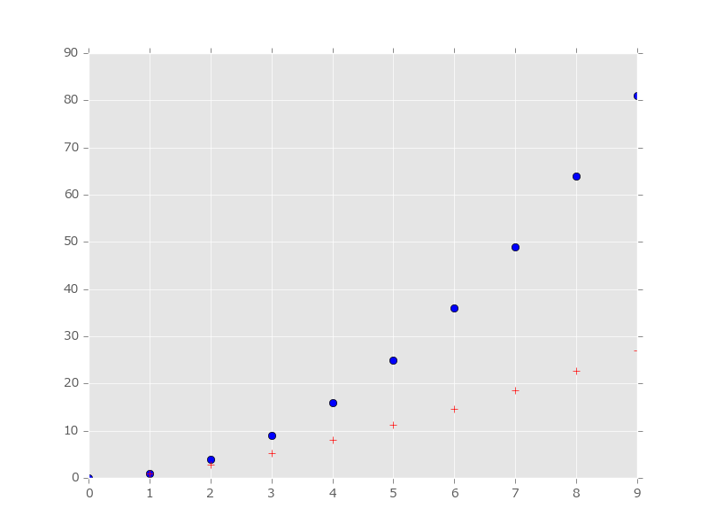
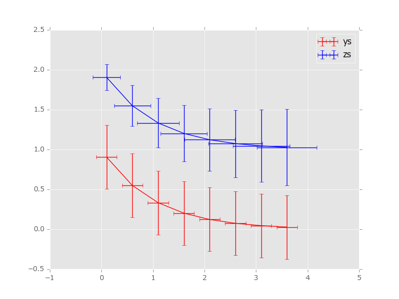
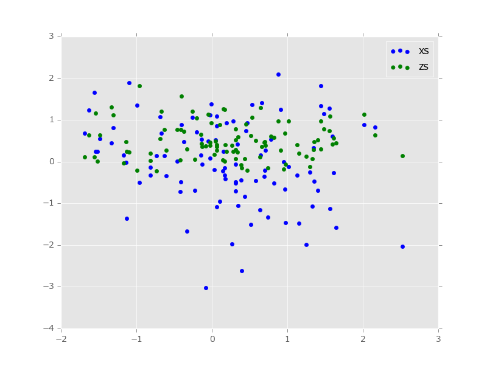
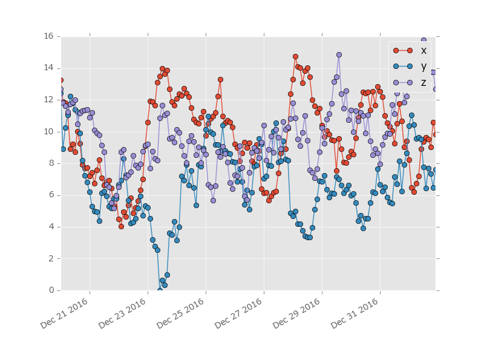

### 03plot_plot.py

code

```python
import numpy as np
from utatane import as_command


@as_command
def render(plt):
    xs = np.arange(10)

    ys0 = np.power(xs, 2)
    plt.plot(xs, ys0, "bo")  # blue circle

    ys1 = np.power(xs, 1.5)
    plt.plot(xs, ys1, "r+")  # red ditto

```




### 04plot_errorbar.py

code

```python
import numpy as np
from utatane import as_command


@as_command
def render(plt):
    xs = np.arange(0.1, 4, 0.5)
    ys = np.exp(-xs)

    plt.errorbar(xs, ys, xerr=0.2, yerr=0.4, color="r", label="ys")

    zs = ys + 1

    # example variable error bar values
    yerr = 0.1 + 0.2 * np.sqrt(xs)
    xerr = 0.1 + yerr
    plt.errorbar(xs, zs, xerr=xerr, yerr=yerr, color="b", label="zs")

```




### 05plot_scatter.py

code

```python
import numpy as np
from utatane import as_command


@as_command
def render(plt):
    xs = np.random.randn(1, 100)
    ys = np.random.randn(1, 100)

    plt.scatter(xs, ys, color="b", label="xs")

    zs = np.random.randn(1, 100) * 0.5 + 0.5
    plt.scatter(xs, zs, color="g", label="zs")

```




### 06plot_plot_date.py

code

```python
import datetime as dt
import numpy as np
from utatane import as_command


@as_command
def render(plt):
    import matplotlib.dates as mdates

    ts = mdates.drange(dt.datetime(2016, 12, 20), dt.datetime(2017, 1, 2), dt.timedelta(hours=2))
    xs = np.random.normal(0, 1, ts.size).cumsum()
    ys = np.random.normal(0, 1, ts.size).cumsum()
    zs = np.random.normal(0, 1, ts.size).cumsum()
    bottom = min(xs.min(), ys.min(), zs.min())

    xs -= bottom
    ys -= bottom
    zs -= bottom

    plt.plot_date(ts, xs, "o-", label="x")
    plt.plot_date(ts, ys, "o-", label="y")
    plt.plot_date(ts, zs, "o-", label="z")

    plt.gcf().autofmt_xdate()

```



