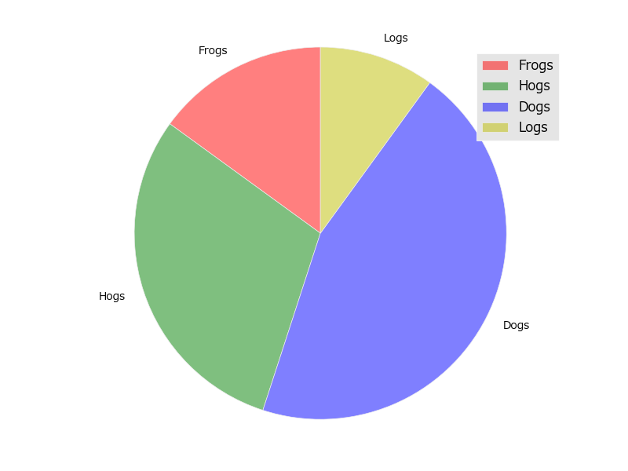

### 03plot_plot.py

code

```python
import numpy as np
from utatane import as_command


@as_command
def render(plt):
    xs = np.arange(10)

    ys0 = np.power(xs, 2)
    plt.plot(xs, ys0, "bo")  # blue circle

    ys1 = np.power(xs, 1.5)
    plt.plot(xs, ys1, "r+")  # red ditto

```


### 04plot_errorbar.py

code

```python
import numpy as np
from utatane import as_command


@as_command
def render(plt):
    xs = np.arange(0.1, 4, 0.5)
    ys = np.exp(-xs)

    plt.errorbar(xs, ys, xerr=0.2, yerr=0.4, color="r", label="ys")

    zs = ys + 1

    # example variable error bar values
    yerr = 0.1 + 0.2 * np.sqrt(xs)
    xerr = 0.1 + yerr
    plt.errorbar(xs, zs, xerr=xerr, yerr=yerr, color="b", label="zs")

```


### 05plot_scatter.py

code

```python
import numpy as np
from utatane import as_command


@as_command
def render(plt):
    xs = np.random.randn(1, 100)
    ys = np.random.randn(1, 100)

    plt.scatter(xs, ys, color="b", label="xs")

    zs = np.random.randn(1, 100) * 0.5 + 0.5
    plt.scatter(xs, zs, color="g", label="zs")

```


### 06plot_plot_date.py

code

```python
import datetime as dt
import numpy as np
from utatane import as_command


@as_command
def render(plt):
    import matplotlib.dates as mdates

    ts = mdates.drange(dt.datetime(2016, 12, 20), dt.datetime(2017, 1, 2), dt.timedelta(hours=2))
    xs = np.random.normal(0, 1, ts.size).cumsum()
    ys = np.random.normal(0, 1, ts.size).cumsum()
    zs = np.random.normal(0, 1, ts.size).cumsum()
    bottom = min(xs.min(), ys.min(), zs.min())

    xs -= bottom
    ys -= bottom
    zs -= bottom

    plt.plot_date(ts, xs, "o-", label="x")
    plt.plot_date(ts, ys, "o-", label="y")
    plt.plot_date(ts, zs, "o-", label="z")

    plt.gcf().autofmt_xdate()

```


### 07plot_step.py

code

```python
import numpy as np
from utatane import as_command


@as_command
def render(plt):
    xs = np.arange(10)

    plt.step(xs, np.power(xs, 2), label="x ** 2")
    plt.step(xs, np.power(xs, 1.75), label="x ** 1.75")
    plt.step(xs, np.power(xs, 1.5), label="x ** 1.5")
    plt.step(xs, np.power(xs, 1.25), label="x ** 1.25")

```


### 08plot_loglog.py

code

```python
import numpy as np
from utatane import as_command


@as_command
def render(plt):
    xs = np.arange(20)
    plt.loglog(xs, np.power(xs, xs), label="x^x")
    plt.loglog(xs, np.power(np.pi, xs), label="e^x")
    plt.loglog(xs, np.power(xs, 2), label="x^2")
    plt.loglog(xs, xs, label="x")

```


### 09plot_bar.py

code

```python
import numpy as np
from utatane import as_command


@as_command
def render(plt):
    xs = np.arange(10)
    ys = np.array(xs, copy=True)
    ys.fill(5)

    plt.bar(xs, xs, label="xs", color="r", alpha=0.3)
    plt.bar(xs, ys, label="ys", color="b", alpha=0.3)

```


### 10plot_barh.py

code

```python
import numpy as np
from utatane import as_command


@as_command
def render(plt):
    xs = np.arange(10)
    ys = np.array(xs, copy=True)
    ys.fill(5)

    plt.barh(xs, xs, label="xs", color="r", alpha=0.3)
    plt.barh(xs, ys, label="ys", color="b", alpha=0.3)

```


### 11plot_pie.py

code

```python
from utatane import as_command


@as_command
def render(plt):
    from matplotlib.colors import colorConverter as c
    labels = ['Frogs', 'Hogs', 'Dogs', 'Logs']
    sizes = [15, 30, 45, 10]
    colors = [c.to_rgba(x, alpha=0.5) for x in ["r", "g", "b", "y"]]
    plt.pie(sizes, labels=labels, startangle=90, colors=colors)
    plt.gca().axis('equal')

```




### 12plot_eventplot.py

code

```python
from utatane import as_command
import numpy as np


@as_command
def render(plt):
    data = np.random.random([6, 50])
    colors = np.random.rand(6, 4)
    lineoffsets = np.array([-15, -3, 1, 1.5, 6, 10])
    linelengths = [5, 2, 1, 1, 3, 1.5]
    plt.eventplot(data, colors=colors, linelengths=linelengths, lineoffsets=lineoffsets)

```


